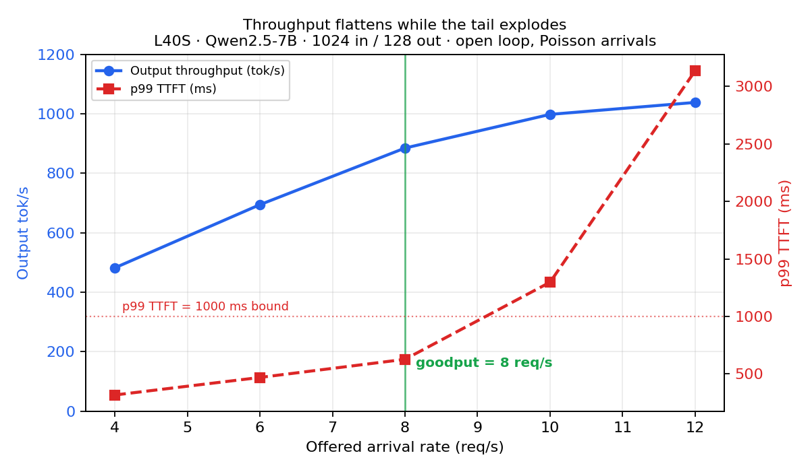

# LLM Inference, Measured

Nine predictions about a GPU serving stack, each written down **before** the run, then measured and reconciled against the term that explained the gap.

**Rig, frozen across every row:** 1× NVIDIA L40S (48 GB, 864 GB/s, sm89) · `Qwen/Qwen2.5-7B-Instruct` · bf16 · vLLM 0.27.1 · torch 2.13.0

Every number in [`scoreboard.md`](scoreboard.md) came off this box. Nothing is quoted from a paper or a blog post.

---

## The one equation

```
bytes per step  =  weight_bytes  +  Σ over live requests ( 56 KiB × its context length )
                   ───────────       ──────────────────────────────────────────────────
                   shared, fixed     private per request, re-read every step
```

`weight_bytes` = 7,615,616,512 params × 2 bytes = **15.23 GB**
`56 KiB/token` = `2 × 28 layers × 4 KV heads × 128 head_dim × 2 bytes`, read out of `config.json`

Divide by 864 GB/s and you have a floor. Which term dominates tells you what kind of machine you're on.

**Memory bandwidth utilisation (MBU) = byte floor ÷ measured ITL = 17.6 / 20.23 = 0.87.**

---

## Headline results

| Measurement | Result |
|---|---|
| Decode byte floor vs measured ITL @ concurrency 1 | 17.6 ms vs **20.23 ms** (MBU 0.87) |
| Prefill rate | **69.5 ms per 1k prompt tokens** — 61% of peak dense bf16 FLOP/s |
| Batching, cost per 1M output tokens | **$10.56 → $0.30** (concurrency 1 → 64) |
| Batching knee, measured to move with context | B≈518 at 512 tok → **B≈69 at 3840 tok** |
| Goodput, open-loop Poisson arrivals | **8 req/s** at p99 TTFT 628 ms |
| Prefix cache: TTFT cold → warm | **144.5 → 31.0 ms** (4.7×), hit rate 66.1% |
| fp8 weights: ITL @ conc 1 / conc 64 | **1.44× / 1.59×**, KV pool +29% |

Full rows, with predictions and reconciliations, in [`scoreboard.md`](scoreboard.md).

---

## The chart



Offered arrival rate on x. **Throughput gains 4% from rate 10 → 12 while p99 TTFT gains 142%.**

Peak throughput was 1,039 tok/s at a 3.1-second p99 — a number you reach by letting the queue grow, and one you would never ship. Goodput is 8 req/s. Every earlier row in this repo was measured with `--max-concurrency` pinned, which is a **closed loop**: the client only sends when a request completes, so the load quietly shrinks when the server struggles and a queueing tail can never form. Those rows are valid for step time and throughput. **None of them can produce a p99**, which is why this one dropped the flag.

---

## The worst miss

**Predicted +3.4 ms of host-side kernel-launch overhead. Measured +0.34 ms — off by 10×.**

The reasoning was `340 launches × ~10 µs`, treating CPU launch time as additive to wall clock. It isn't. The CPU pushes kernels onto a queue and the GPU pops from it **concurrently** — while the GPU executes kernel N, the CPU is already queuing N+1. Launch cost only becomes latency when the queue *drains*.

```
wrong:  added latency = launches × launch_cost
right:  added latency = Σ max(0, launch_cost − gpu_time_per_kernel)
```

At ~60 µs of GPU work per kernel against a ~1–10 µs launch, the host stays far ahead and the cost is invisible.

**The counter-intuitive consequence: a slower GPU hides launch overhead better.** On an H100 (~4× the bandwidth) kernels finish ~4× sooner, host slack shrinks, and the overhead starts to bite. **Launch overhead is a fast-GPU problem.**

### Three more places the model was wrong for this hardware

- **The batching equation** predicts the knee's *location* well and its *depth* badly — measured ITL rose 4.3× more than predicted at short context, because per-request attention-kernel and scheduler cost isn't in the model.
- **A p99 ITL bound of 50 ms was unachievable at any arrival rate**, not just high ones — p99 ITL was 139 ms at the lightest load tested, because prefill preempts decode and rate barely moves it. It is a scheduling problem, not a rate problem.
- **The fp8 win was expected to collapse at batch 64. It improved** (1.44× → 1.59×), because at 512-token context the knee is at B≈518 — batch 64 is nowhere near it and the weight term still dominates 8:1.

---

## Measured vs computed

Three rows are arithmetic and are labelled as such, because one card cannot test them:

| | Why not measured |
|---|---|
| Tensor-parallel sharding, `17.6/N` + per-layer sync tax | one GPU |
| Speculative decoding, 2.77 accepted tokens/verify at a=0.7, k=4 | no second model served |
| Reserve-max vs paged concurrency, 110 vs 755 | vLLM has no unpaged mode to A/B against |

Two notes on those, since both attract confident wrong answers: sharding's sync messages are a few KB, so it is a **fixed latency tax, not a bandwidth problem** — interconnect GB/s is the wrong axis. And speculative decoding preserves the output **distribution**, not the token stream; never claim bitwise identity.

---

## Reproducing it

```bash
pip install -U vllm
vllm serve Qwen/Qwen2.5-7B-Instruct \
  --max-model-len 4096 --gpu-memory-utilization 0.90 --block-size 16
```

Scripts for each sweep are in [`scripts/`](scripts/). Two things worth copying regardless of what you measure:

- **Confirm `/health` returns 200 before trusting any benchmark.** A sweep here silently reported `ITL 0.00` for three points because input + output exceeded `--max-model-len` and every request was rejected.
- **Report median ITL, and treat a large mean/median gap as a diagnostic** — it means prefill is stealing decode steps, not that your measurement is noisy.

---

## License

MIT
